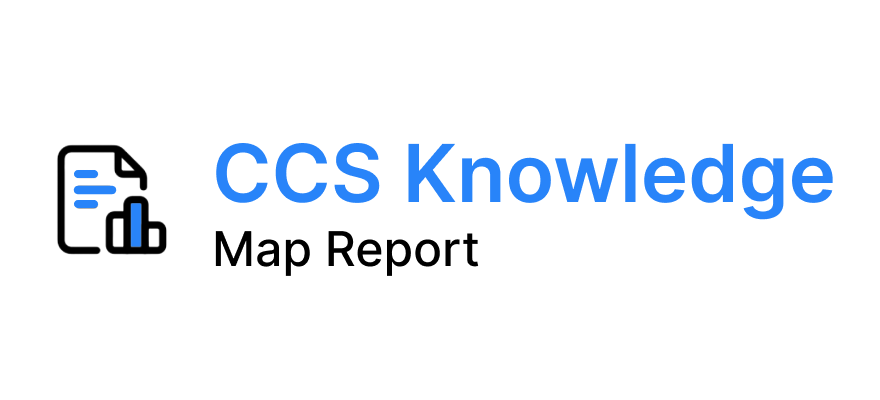

# CCS Knowledge Map

A tool developed to visualize community responses to environmental surveys and display the representativeness of responses, aiding local environmental policymaking and communication.




## Table of Contents

- [CCS Knowledge Map](#ccs-knowledge-map)
- [Introduction](#introduction)
- [Motivation](#motivation)
- [Features](#features)
- [Installation](#installation)
- [Usage](#usage)
- [Examples](#examples)
- [Contributing](#contributing)
- [License](#license)
- [Contact](#contact)
- [Acknowledgements](#acknowledgements)

## Introduction

The CCS Knowledge Map is an RShiny application designed to help different stakeholders, such as city and county government agencies and local NGOs, understand the needs, perceptions, and concerns of Black and Latinx communities regarding urgent environmental issues. The project code is open source and available on GitHub.

## Motivation

Our team aims to empower local communities by providing them with the capacity to discuss environmental justice solutions. This tool was motivated by the need to visualize and analyze community responses collected through various engagement methods.

## Features

- Visualizes community responses to environmental surveys.
- Displays the representativeness of survey responses.
- Supports local environmental policymaking and communication.
- Engages over 300 members from Black and Latinx communities.

## Installation

To install and set up the CCS Knowledge Map project, follow these steps:

```bash
# Clone the repository
git clone https://github.com/madcollab-jrg/ccs-knowledge-map.git

# Navigate to the project directory
cd ccs-knowledge-map

# Install required R packages
install.packages(c("bs4Dash", "shinydashboard"))
```

## Usage

Load the necessary libraries and run the Shiny application:

```R
library(bs4Dash)
library(shinydashboard)

# Run the Shiny app
shinyApp(ui = ui, server = server)
```

## Examples

Here is an example of how to use the CCS Knowledge Map application:


```R
# Load the package
library(bs4Dash)
library(shinydashboard)

# Define the UI and server components
ui <- ...
server <- ...

# Run the Shiny app
shinyApp(ui = ui, server = server)
```

## Contributing

We welcome contributions from the community. To contribute, follow these steps:

1. Fork the repository
2. Create a new branch (`git checkout -b feature-branch`)
3. Make your changes and commit them (`git commit -m 'Add new feature'`)
4. Push to the branch (`git push origin feature-branch`)
5. Open a Pull Request

## License

This project is licensed under the [MIT License](LICENSE).

## Contact

For any questions or feedback, please contact us at:

- Email: [yourname@example.com](mailto:yourname@example.com)
- LinkedIn: [Your Name](https://linkedin.com/in/yourname)

## Acknowledgements

We would like to thank the following individuals and organizations for their contributions:

- **Faculty**:
  - [Dr. Corey Jackson](https://coreybjackson.com), School of Information, University of Wisconsin-Madison
  - [Dr. Kaiping Chen](http://www.kaipingchen.com), Department of Life Sciences Communication, University of Wisconsin-Madison
- **Developers**:
  - Christian Varner, PhD student in Statistics
  - Niharika Chunduru, Master’s student in Statistics & Data Science
  - Shelcia David, Master’s student in Informations
- **Researchers**:
  - Corey Black, Master’s student in the School of Information
  - Vincent Kong, Undergraduate student in Computer Science (Graduated 2023)
  - Vaathsalya Karpe, Undergraduate student (Graduated 2023)
  - Kyla Smith, Master’s student in Energy Analysis and Policy
- **Partners**:
  - Wisconsin EcoLatinos
  - Urban Triage
  - Dane County Office of Energy & Climate Change
  - City of Madison

Thank you for your support and contributions to this project.
